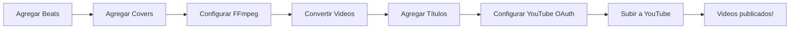

# 🚀 INSTRUCCIONES PARA USAR ECB TOOL

## ✅ **PASOS PARA HACER FUNCIONAR EL PROYECTO**

### 1. **Agregar Archivos de Entrada**

#### 📁 Beats (Audios)
Coloca tus archivos de audio en:
```
workspace/beats/
```
**Formatos soportados:** `.mp3`, `.wav`, `.flac`, `.m4a`

**Ejemplo:**
```
workspace/beats/
  ├── beat1.mp3
  ├── beat2.wav
  └── trap_beat_hard.mp3
```

#### 🖼️ Covers (Portadas)
Coloca tus imágenes en:
```
workspace/covers/
```
**Formatos soportados:** `.jpg`, `.jpeg`, `.png`

**Ejemplo:**
```
workspace/covers/
  ├── cover1.jpg
  ├── cover2.png
  └── abstract_art.jpg
```

**Recomendaciones:**
- Resolución mínima: 1280x720 (HD)
- Resolución recomendada: 1920x1080 (Full HD)
- Formato cuadrado (1:1) o 16:9

---

### 2. **Ejecutar la Aplicación**

#### Opción A: Usando el script batch
```bash
run.bat
```

#### Opción B: Desde la terminal
```bash
.venv\Scripts\python.exe main.py
```

#### Opción C: Desde VS Code
Presiona `F5` o usa el debugger

---

### 3. **Configurar el Proceso**

#### **Modo Convertir**
1. Selecciona "Convert" en el modo
2. Ajusta **BPV** (Beats Por Video) - cuántos beats usar por video
3. Configura **Órdenes** - cuántos videos generar
4. Presiona "▶ INICIAR"

**Resultado:** Se crearán videos en `workspace/videos/`

#### **Modo Subir**
1. Primero debes tener videos en `workspace/videos/`
2. Verifica que `data/titles.txt` tenga títulos (1 por línea)
3. Verifica que `data/description.txt` tenga la descripción
4. Configura OAuth de YouTube (ver siguiente sección)
5. Selecciona "Upload" y presiona "▶ INICIAR"

**Resultado:** Videos subidos a YouTube y movidos a `uploaded/`

---

### 4. **Configurar YouTube OAuth (IMPORTANTE para Uploads)**

#### Paso 1: Crear proyecto en Google Cloud
1. Ve a https://console.cloud.google.com/
2. Crea un nuevo proyecto o usa uno existente
3. Nombre sugerido: "ECB Tool YouTube Uploader"

#### Paso 2: Habilitar YouTube Data API v3
1. En el menú, ve a **APIs & Services** > **Library**
2. Busca "YouTube Data API v3"
3. Click en **Enable**

#### Paso 3: Crear credenciales OAuth
1. Ve a **APIs & Services** > **Credentials**
2. Click **+ CREATE CREDENTIALS** > **OAuth client ID**
3. Si te pide, configura **OAuth consent screen**:
   - User Type: **External**
   - App name: ECB Tool
   - User support email: tu email
   - Developer contact: tu email
4. Tipo de aplicación: **Desktop app**
5. Nombre: ECB Tool Desktop
6. Click **Create**

#### Paso 4: Descargar credenciales
1. Click en el botón de descarga (⬇️) junto a tu OAuth client
2. Se descargará un archivo JSON
3. **Renómbralo a:** `client_secrets.json`
4. **Muévelo a:** `oauth/client_secrets.json`

#### Paso 5: Primera autenticación
1. La primera vez que subas un video, se abrirá un navegador
2. Inicia sesión con tu cuenta de YouTube
3. Acepta los permisos
4. Se guardará un token en `oauth/token.pickle`

**⚠️ IMPORTANTE:** 
- No compartas `client_secrets.json` ni `token.pickle`
- Están en `.gitignore` por seguridad

---

### 5. **Configuraciones Avanzadas**

#### FFmpeg Settings (⚙️ botón superior)
- **Resolución:** 1920x1080, 1280x720, etc.
- **FPS:** 30, 60
- **Bitrate de video:** 2M (2 Mbps) por defecto
- **Bitrate de audio:** 192k por defecto
- **Fades:** Entrada/salida de audio y video
- **Auto-borrado:** Eliminar beats/covers procesados

#### Upload Settings (📤 botón superior)
- **Calendario:** Programa cuántos videos subir cada día
- **Hora de subida:** A qué hora se subirán
- **Estado:** Público, Privado, No listado
- **Limpieza:** Qué hacer con videos tras subir

#### General Settings (🏠 botón superior)
- **Tema:** 6 colores disponibles
- **Idioma:** Español, English, Français
- **Rutas:** Personalizar carpetas de trabajo

---

### 6. **Modos de Operación**

#### 🔄 Convert
Solo convierte beats + covers → videos

#### ⬆️ Upload  
Solo sube videos existentes a YouTube

#### 🔀 Alternate
Alterna: convierte 1 video, lo sube, repite

#### ⚡ Simultaneous
Convierte Y sube al mismo tiempo (paralelo)

---

### 7. **Verificar que Funciona**

#### Test rápido de conversión:
1. Agrega 1 beat y 1 cover
2. Modo: **Convert**
3. BPV: **1**
4. Órdenes: **1**
5. Click **▶ INICIAR**
6. Espera 10-30 segundos
7. Verifica que aparezca un video en `workspace/videos/`

#### Test de interfaz:
```bash
.venv\Scripts\python.exe main.py
```
- ✅ Ventana debe abrir sin errores
- ✅ Panel de estado debe mostrar contadores
- ✅ Botones deben responder con hover
- ✅ Cambiar tema debe actualizar colores

---

### 8. **Solución de Problemas Comunes**

#### "No se encontró FFmpeg"
- Verifica que existe: `ffmpeg\bin\ffmpeg.exe`
- Si no existe, descarga FFmpeg de https://ffmpeg.org/

#### "No beats disponibles"
- Agrega archivos `.mp3` o `.wav` a `workspace/beats/`

#### "No covers disponibles"
- Agrega archivos `.jpg` o `.png` a `workspace/covers/`

#### "Error al subir a YouTube"
- Verifica `oauth/client_secrets.json` existe
- Reautentica borrando `oauth/token.pickle` y volviendo a intentar

#### "AttributeError: 'ConfigManager' object has no attribute 'set'"
- ✅ **YA CORREGIDO** en esta sesión

---

### 9. **Estructura de Carpetas Completa**

```
ECB TOOL/
├── workspace/
│   ├── beats/        ← TUS AUDIOS AQUÍ
│   ├── covers/       ← TUS IMÁGENES AQUÍ
│   ├── videos/       ← VIDEOS GENERADOS
│   ├── procesed/     ← Archivos procesados
│   └── trash/        ← Papelera
├── data/
│   ├── titles.txt        ← 1 título por línea
│   ├── description.txt   ← Descripción común
│   ├── conversion_state.csv
│   └── upload_state.csv
├── oauth/
│   ├── client_secrets.json  ← Credenciales YouTube
│   └── token.pickle         ← Token de acceso
├── config/
│   ├── orden.json
│   ├── ajustes_conversion.json
│   ├── ajustes_subida.json
│   └── rutas.json
└── ffmpeg/
    └── bin/
        ├── ffmpeg.exe
        ├── ffprobe.exe
        └── ffplay.exe
```

---

### 10. **Flujo de Trabajo Recomendado**



**Pasos:**
1. 📁 Agregar archivos (beats + covers)
2. ⚙️ Configurar conversión
3. 🎬 Convertir videos
4. 📝 Preparar títulos/descripción
5. 🔑 Configurar OAuth
6. 📤 Subir a YouTube
7. ✅ ¡Listo!

---

## 🎯 **SIGUIENTE NIVEL**

Una vez funcione todo:
- [ ] Crear tests automatizados
- [ ] Implementar logging estructurado
- [ ] Mejorar validación de archivos
- [ ] Agregar preview de videos
- [ ] Sistema de plantillas para descripciones
- [ ] Integración con otras plataformas
- [ ] Dashboard de analytics

---

## 📞 **SOPORTE**

Si tienes problemas:
1. Revisa `data/app.log` para ver errores
2. Verifica todas las carpetas tengan archivos
3. Asegúrate de usar el entorno virtual
4. Comprueba versión de Python: 3.13+

**¡Éxito con tu proyecto!** 🚀
